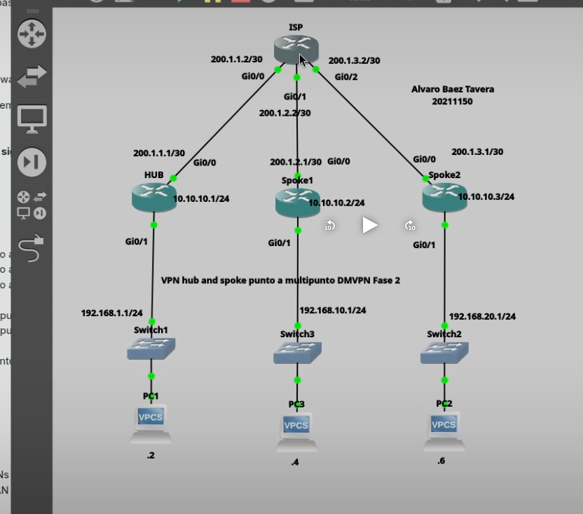
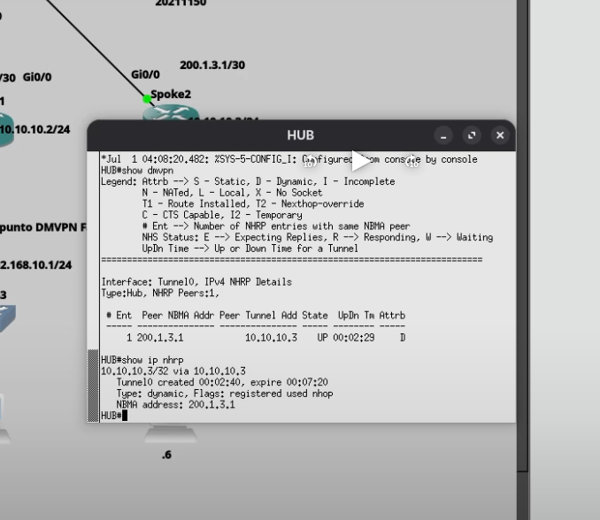
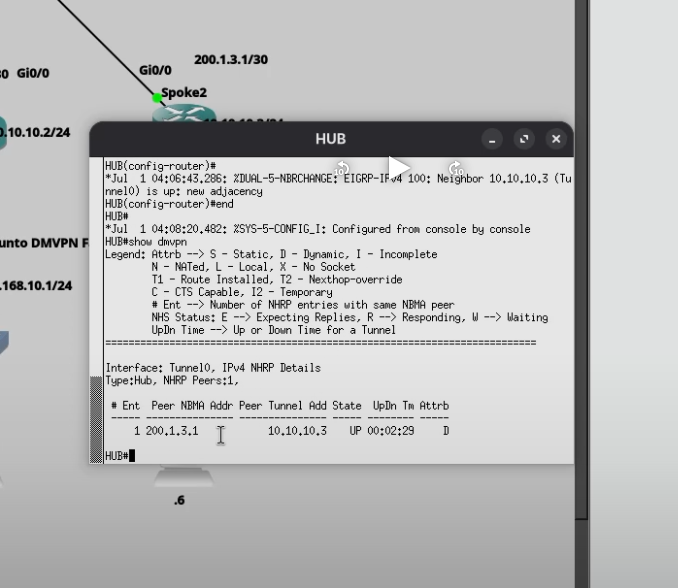
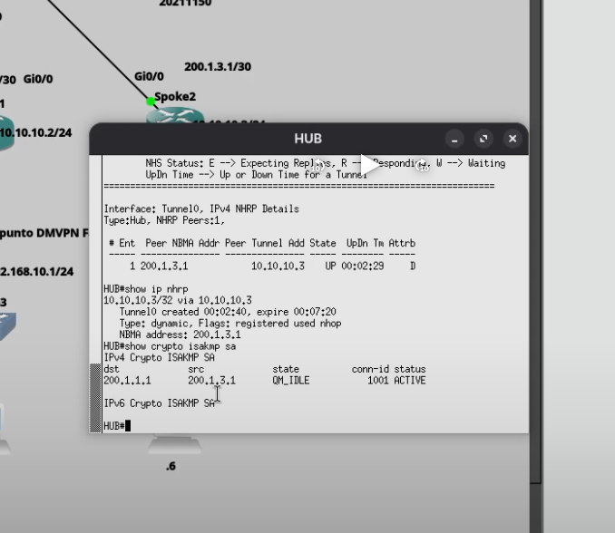
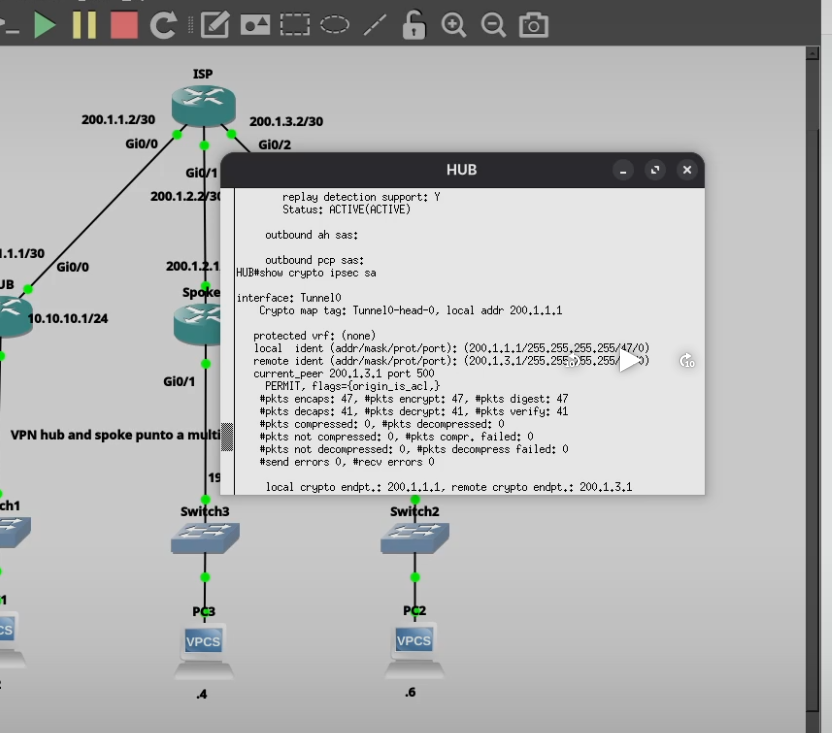
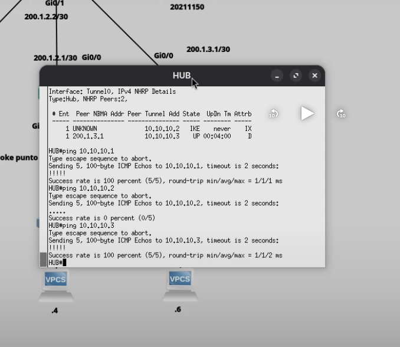
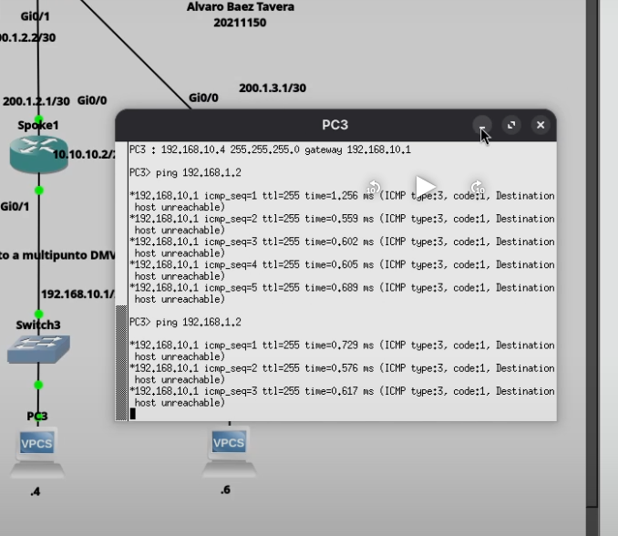

# VPN Hub and Spoke Punto a Multipunto DMVPN Fase 2 con IPSec IKEv1

## Descripción

En esta práctica se implementó una VPN Dynamic Multipoint VPN (DMVPN) Fase 2 utilizando IPSec con IKEv1 y el protocolo de enrutamiento dinámico EIGRP. La solución permite que múltiples sedes remotas (Spokes) se conecten de forma segura a un concentrador principal (Hub), optimizando el tráfico mediante túneles dinámicos protegidos con IPSec.

---

# Objetivo

Implementar una VPN Hub and Spoke punto a multipunto (DMVPN Fase 2) utilizando IPSec IKEv1, permitiendo la comunicación segura entre las diferentes redes LAN mediante un túnel dinámico protegido.

---

# Topología



La topología está compuesta por:

- Router HUB
- Router ISP
- Router Spoke1
- Router Spoke2
- Tres switches
- Tres equipos VPCS

---

# Direccionamiento IP

## HUB

| Interfaz | Dirección |
|----------|-----------|
| GigabitEthernet0/0 | 200.1.1.1/30 |
| GigabitEthernet0/1 | 192.168.1.1/24 |
| Tunnel0 | 10.10.10.1/24 |

---

## ISP

| Interfaz | Dirección |
|----------|-----------|
| GigabitEthernet0/0 | 200.1.1.2/30 |
| GigabitEthernet0/1 | 200.1.2.2/30 |
| GigabitEthernet0/2 | 200.1.3.2/30 |

---

## Spoke 1

| Interfaz | Dirección |
|----------|-----------|
| GigabitEthernet0/0 | 200.1.2.1/30 |
| GigabitEthernet0/1 | 192.168.10.1/24 |
| Tunnel0 | 10.10.10.2/24 |

---

## Spoke 2

| Interfaz | Dirección |
|----------|-----------|
| GigabitEthernet0/0 | 200.1.3.1/30 |
| GigabitEthernet0/1 | 192.168.20.1/24 |
| Tunnel0 | 10.10.10.3/24 |

---

## Equipos finales

| Equipo | Dirección |
|---------|-----------|
| PC1 | 192.168.1.2 |
| PC3 | 192.168.10.4 |
| PC2 | 192.168.20.6 |

---

# Parámetros utilizados

| Parámetro | Valor |
|-----------|-------|
| Tipo VPN | DMVPN Fase 2 |
| IKE | Version 1 |
| IPSec | Sí |
| Encriptación | AES |
| Hash | SHA |
| Autenticación | Pre-Shared Key |
| Protocolo de Enrutamiento | EIGRP |
| Túnel | GRE Multipoint |
| NHRP | Habilitado |

---

# Configuración realizada

Se configuró:

- Interfaces Tunnel0.
- NHRP.
- GRE Multipoint.
- IPSec IKEv1.
- Crypto Map.
- Transform Set.
- EIGRP para el intercambio dinámico de rutas.
- Rutas entre todas las sedes.

---

# Funcionamiento

El router HUB actúa como punto central de registro NHRP.

Cada Spoke establece un túnel seguro IPSec hacia el HUB utilizando GRE Multipoint.

Mediante EIGRP se distribuyen automáticamente las rutas entre todas las LAN, permitiendo que los equipos puedan comunicarse de forma segura sin necesidad de configurar rutas estáticas adicionales.

---

# Evidencias

## Topología


Topología implementada en GNS3 para la práctica DMVPN Fase 2.

---

## Registro NHRP



Se verificó el registro correcto de los Spokes mediante:

```bash
show ip nhrp
```

El HUB reconoce los vecinos registrados y sus direcciones NBMA.

---

## Estado DMVPN



Se verificó el funcionamiento del túnel mediante:

```bash
show dmvpn
```

El estado **UP** confirma que los túneles dinámicos fueron creados correctamente.

---

## Estado IKEv1



Se comprobó el establecimiento de la Fase 1 utilizando:

```bash
show crypto isakmp sa
```

El estado **QM_IDLE** indica que la negociación IKE fue completada correctamente.

---

## Estado IPSec



Se verificó el cifrado del tráfico mediante:

```bash
show crypto ipsec sa
```

Los contadores de paquetes encapsulados y desencapsulados aumentan conforme existe tráfico entre las sedes.

---

## Verificación del túnel



Se realizó un ping desde el HUB hacia la dirección del túnel del Spoke 2 (10.10.10.3).

```text
HUB# ping 10.10.10.3
```

La respuesta satisfactoria confirma:

- Funcionamiento del túnel GRE.
- Registro correcto mediante NHRP.
- IPSec operativo.
- Conectividad entre los extremos del túnel.

---

## Comunicación entre LANs



Finalmente se comprobó la comunicación entre las redes LAN de las diferentes sedes mediante paquetes ICMP.

Esta prueba confirma el correcto funcionamiento de toda la infraestructura DMVPN Fase 2 utilizando IPSec IKEv1 y enrutamiento dinámico.

---

# Verificación

Durante la práctica se utilizaron los siguientes comandos de verificación:

```bash
show dmvpn

show ip nhrp

show crypto isakmp sa

show crypto ipsec sa

show ip route

show ip eigrp neighbors
```

---

# Video demostrativo

La demostración completa del funcionamiento se encuentra disponible en:

https://youtu.be/L5fhHcBBWwg?si=8Yf7fAYuNpAweOmv

---

# Autor

**Alvaro Baez Tavera**

**Matrícula:** 20211150

**Instituto Tecnológico de las Américas (ITLA)**

**Carrera:** Ciberseguridad
